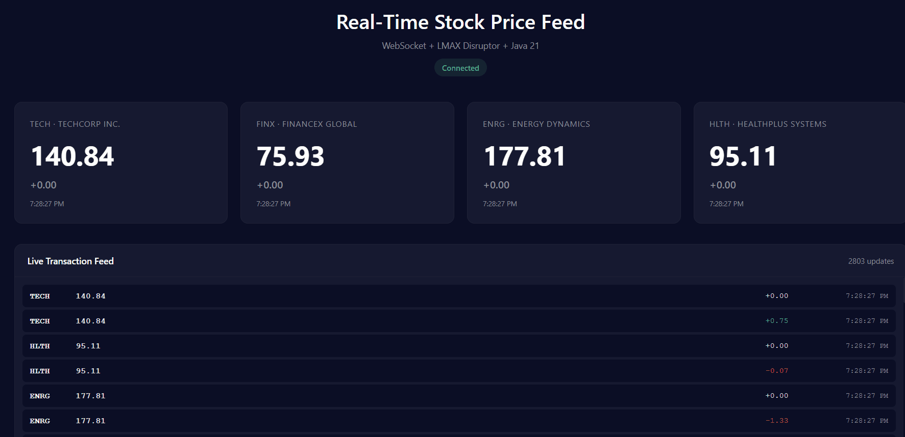

# Real-Time Stock Price Feed Server

Low-latency WebSocket server demonstrating Java 21 concurrency with LMAX Disruptor.



## Tech Stack
- Java 21 (virtual threads, records)
- LMAX Disruptor (lock-free ring buffer)
- Embedded Jetty 11 (WebSocket)
- Gradle 8.x

## Features
- 4 concurrent stock feeds (TECH, FINX, ENRG, HLTH)
- Real-time price updates (50-100ms intervals)
- Live transaction feed with price changes
- WebSocket broadcasting to multiple clients
- Lock-free concurrent event processing

## Run
```bash
./gradlew run
```

Open browser: `http://localhost:8080`

## Test
```bash
./gradlew test
```

## Build JAR
```bash
./gradlew build
java -jar build/libs/price-server-1.0.0.jar
```

## Architecture
```
4 Producer Threads → Disruptor Ring Buffer → Event Handler → WebSocket Broadcast
    (50-100ms)          (1024 slots)         (JSON format)    (all clients)
```

Multi-producer, single consumer, yielding wait strategy for low latency.

## Performance
- Sub-millisecond event processing
- Handles 1000+ updates/second
- Efficient broadcast to multiple WebSocket clients
- Zero garbage allocation in hot path